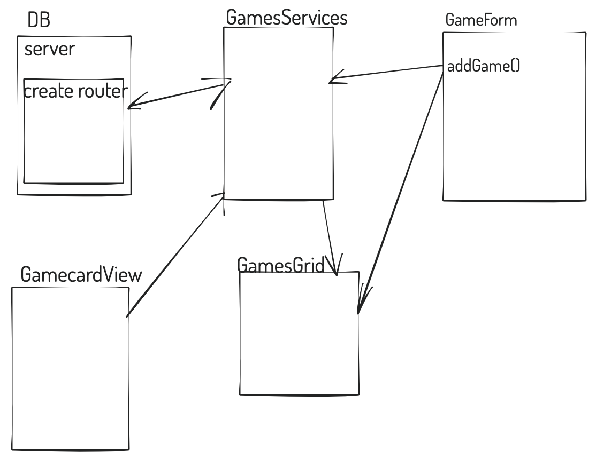

What is responsible for defining the routes of the games resource?
- express module instance 'app' ? along with the 'express.Router() function

What do you notice about the folder structure? Whats the client responsible for? Whats the server responsible for?
- client: the display and define methods that pass information into the "server", there is a gamesService.js that deals with fetch's 
- server: to handle client side information and pass info between db and client.

What are the the responsibilities of server.js?
- Configuring the express server and adding any additional modules via the instanc.use() method

What are the responsibilities of the gamesRouter?
- associates routes with http/express funcitons - provides route/handlers

What process does the the client (front-end) use to communicate with the server?
- GamesService.js

What optional second argument does the fetch method take? And what is it used for in this application? Hint: See Using Fetch on the MDN docs
- As the 2nd argument you can use an Init object which has the options with which you can initialize the fetch method. 

Which of the games API routes does the front-end application consume (i.e. make requests to)?
- '/api/games/'
- '/api/games/id'

What are we using the MongoDB Driver for?